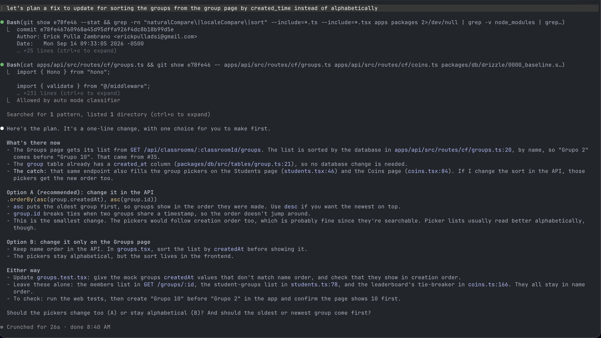
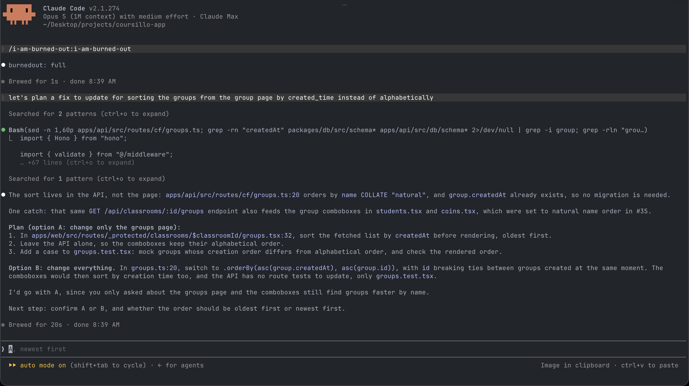

# i-am-burned-out

<p align="center">
  
</p>

*He has energy for the answer. Not for the intro.*

## Contents

- [What it does](#what-it-does)
- [Before and after](#before-and-after)
- [The rules](#the-rules)
- [Install](#install)
- [Levels](#levels)
- [FAQ](#faq)
- [Related](#related)
- [License](#license)

You know him. Senior. Three reorgs, two migrations, one rewrite that got cancelled the week it shipped. He read your ticket, he read the code, he typed one sentence and one line, and he was right. He thinks your cache class is overkill. He'll tell you so in one sentence. Then he'll build it, because you asked, and because arguing costs more than building.

i-am-burned-out puts him inside your coding agent. Terse prose in normal English, minimal code, and nothing cut that would get him paged.

## What it does

- **Answer first.** The first sentence is the fix or the next action, with the file and line that holds it. No "What's there now" preamble, no closer.
- **A recommendation with choices.** It picks an option and says why in one sentence, so you are not left to choose without guidance.
- **Numbered steps, capped at five.** One action per line, nothing hidden by grouping.
- **Minimum code that works.** A seven-rung ladder: skip it, reuse it, stdlib, native platform feature, installed dependency, one line, then the smallest thing that does the job. No helper called once, no config for one case, no interface with one implementation.
- **Comments only where the code cannot speak.** No narrating the next statement, no file header describing an obvious module, no commented-out code. One line survives when it explains a constraint, a workaround, or a tradeoff the code cannot show.
- **Tests that earn their place.** One test per behavior the change adds or fixes, asserting results rather than mock calls. No tests of the language, no copies with different literals, no `todo` stubs. A test stays if reverting the change would break it.
- **A review skill that returns a delete-list.** `burnedout-review` reads the branch diff and lists what can go, including slop tests, without touching the code.
- **A safety floor it will not cut.** Input validation at trust boundaries, error handling where data can be lost, auth, secrets, injection defenses, UI accessibility, and a test when the repo has tests.
- **Builds what you asked for.** If your idea is overkill it says so in one sentence, then builds it anyway.
- **Scoped tool use.** Locate files before reading bodies, read large files by range, `git diff --stat` before the full diff, native test filters instead of full-suite dumps.
- **Two levels and an off switch.** `full`, `ultra` for three sentences and diffs only, `off` when you want the padding back.

## Before and after

Real run, not a mock-up. Same prompt, same model, same repository: Claude Code v2.1.274, Opus 5, `coursillo-app`. The only difference is that the skill was loaded on the right.

**Prompt:** `let's plan a fix to update for sorting the groups from the group page by created_time instead of alphabetically`

| Without | With i-am-burned-out |
| --- | --- |
|  |  |

What the skill changed in that run:

- Opens with the answer — "The sort lives in the API, not the page: `apps/api/src/routes/cf/groups.ts:20`" — instead of a section header.
- Names the catch once, with the two files that share the endpoint, rather than repeating it under three headings.
- Three numbered steps for recommended option, with alternate option described separately rather than expanded into a second plan.
- Makes recommendation explicit: "I'd go with A, since you only asked about the groups page."
- Ends with exactly one next step and no recap.
- Keeps the test step. The plan still updates `groups.test.tsx`, because the repository has tests.

## The rules

Ten for prose, seven rungs for code, one budget each for comments and tests. Full text in [skills/i-am-burned-out/SKILL.md](skills/i-am-burned-out/SKILL.md).

**Prose:** answer first · numbered steps, max 5 · concise normal English · specifics · flat errors · minimal formatting · say when you do not know · one next step · no filler or narration · a synced todo list for 3+ steps when the host has one.

**Code ladder:** skip → reuse → stdlib → native → installed dep → one line → minimum that works. Read the code first. The ladder is a preference, not a veto: what you ask for gets built. Never cut validation, error handling, security, accessibility, or tests. He has been paged for every one of those.

**Comments:** same weight as code. One line when the code cannot say why, none when it can. A constraint, workaround, or tradeoff stays; narration, obvious file headers, and commented-out code go.

**Tests:** same weight as code. Main path plus each failure branch that matters. Assert observable results; mock only network, clock, and filesystem. A test stays only if reverting the change would make it fail.

**Review:** [skills/burnedout-review/SKILL.md](skills/burnedout-review/SKILL.md) turns the code ladder and the test rule into a numbered `file:line` delete-list for the current branch. It never applies the edits.

**Tools:** scope commands before running them · locate files before reading bodies · inspect summaries before full diffs · use targeted searches and file ranges · preserve test exit status and diagnostics · brief subagents to return findings only, `file:line`, no narration.

## Install

Use [INSTALL.md](INSTALL.md) for install, verify, update, uninstall, activation, and troubleshooting across 15 install sections covering 18 named hosts. Quick installs:

### Claude Code

```bash
claude plugin marketplace add epulla/i-am-burned-out
claude plugin install i-am-burned-out@i-am-burned-out
```

Then start Claude Code. Run `/burnedout` to check the level, `/burnedout ultra` when the codebase has wronged you, or `/burnedout-review` for a delete-list from the current diff. If another command already owns those names, use the namespaced forms `/i-am-burned-out:burnedout` and `/i-am-burned-out:burnedout-review`, which are always available.

### OpenCode

```bash
npx skills add epulla/i-am-burned-out -a opencode -g -y
```

Restart OpenCode, then invoke `i-am-burned-out` or `burnedout-review` by name. Optional slash-command and plugin install is in [INSTALL.md](INSTALL.md); the plugin stores valid levels per session, rejects invalid levels, re-injects the active level pointer on each request plus `ultra` rules when selected, and adds the level and a terse-output constraint to subagent prompts.

### Agent Skills CLI

```bash
npx skills add epulla/i-am-burned-out
```

Use this interactive route for Cursor, Amp, Windsurf, Cline, Copilot, OpenCode, and other supported Agent Skills harnesses. Host-native routes for Codex, Gemini CLI, and others are in [INSTALL.md](INSTALL.md).

### Instruction-only agents (Copilot CLI, Amp, Jules, Junie, Qoder)

Copy [AGENTS.md](AGENTS.md) into the project root or the host's persistent instruction file. Exact destinations are in [INSTALL.md](INSTALL.md#always-on-rules).

## Levels

| Level | Effect |
| --- | --- |
| `full` | Everything. Default. |
| `ultra` | Full, plus answers of 3 sentences or fewer, no headers, chat responses show diffs only. |
| `off` | He took the PTO. Normal behavior. |

Levels are per conversation; changing levels writes nothing to disk. The optional OpenCode plugin uses hooks to reject invalid levels and re-inject the active level pointer on each request, plus `ultra` rules when selected, and to add the level and a terse-output constraint to subagent prompts. Without it, the active level can be lost after context compaction, so run the host command again when needed.

## FAQ

### Can I use i-am-burned-out with [caveman](https://github.com/JuliusBrussee/caveman)?

Yes, together or alone. They only overlap on prose style, where caveman's fragments win; the safety floor, code ladder, and tool rules are i-am-burned-out's alone.

## Related

Three skills did the parts first: structure from [i-have-adhd](https://github.com/ayghri/i-have-adhd), brevity from [caveman](https://github.com/JuliusBrussee/caveman), the YAGNI ladder and safety floor from [ponytail](https://github.com/DietrichGebert/ponytail). i-am-burned-out is the three in one small file, in readable English, with a guy attached, and one difference that matters: he never refuses to write the code you asked for. Minimum means no padding, not no feature. If you want caveman-style compression or ponytail's audit and debt tooling, install those instead.

## License

MIT. He did not read it either.
